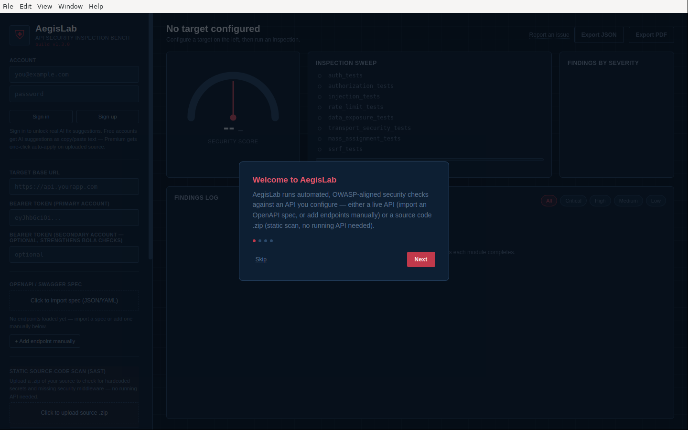
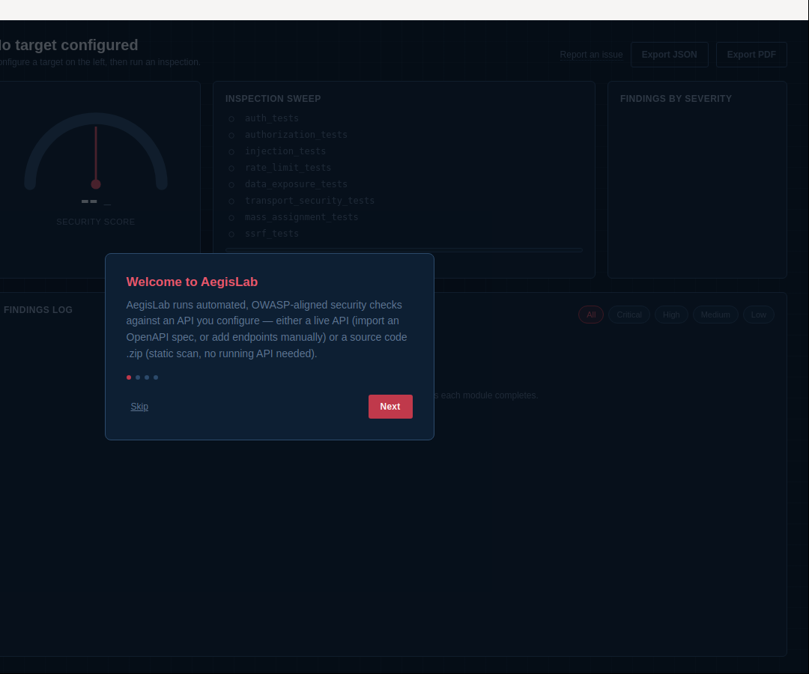

# AegisLab

**Automated, OWASP-aligned API security testing — for APIs you own.**

AegisLab is a desktop application that connects to a backend API (NestJS, Express, Supabase, or any REST API), imports its OpenAPI/Swagger spec, and runs a battery of non-destructive security checks mapped to the **OWASP API Security Top 10**. It also includes a **static source-code scanner (SAST)**: upload a `.zip` of your codebase and it checks for hardcoded secrets and missing security middleware, without needing a running API at all. Both modes report findings as a security score (0–100), a categorized findings log, and exportable JSON/PDF reports.

```
                    ┌──────────────────────────┐
   live API   ─────▶│                          │
   (DAST)            │  Python Security Engine │ ───▶  Security Score, OWASP-
                    │  (FastAPI, async httpx)  │       mapped findings, JSON/PDF
   source .zip ────▶│   + static SAST scanner  │       reports
   (SAST)            └──────────────────────────┘
                              ▲
                              │ REST + WebSocket
                    ┌──────────────────────────┐
                    │   Electron Desktop UI    │
                    └──────────────────────────┘
```

**Screenshots** (real, captured from an actual run against `examples/mock_vulnerable_api.py`):

| Onboarding | Live scan result |
|---|---|
|  |  |

---

## ⚠️ Safety & Scope — read this first

AegisLab is built to be safe-by-default, but it is still an active testing tool. Use it responsibly:

- **Only scan APIs you own, or are explicitly authorized to test.** The app will not start a scan until you tick the consent checkbox in the UI (and the backend independently rejects scan requests without it).
- All checks are **detection-only**: they use the same non-destructive probe values published in the OWASP Testing Guide (a stray quote character, a harmless reflected marker, a `$ne` operator, etc.). AegisLab never sends `DROP`/`DELETE`-style payloads, never attempts real exploitation, and never tries to access systems beyond the target you configure.
- Request bursts (used by `rate_limit_tests`) are capped at 20 requests and **stop immediately** the moment the target responds with `429`, so AegisLab will not contribute to a denial-of-service condition.
- Run scans against a **staging environment** where possible, not production, especially the first time you scan a given API.

---

## 1. Project structure

```
AegisLab/
├── backend/                     # Python security engine (FastAPI)
│   ├── main.py                  # REST + WebSocket API
│   ├── models.py                # Shared data models (Pydantic)
│   ├── api_client.py            # Async, rate-safe HTTP client wrapper
│   ├── openapi_parser.py        # OpenAPI/Swagger → endpoint list
│   ├── scanner.py               # Orchestrates all test modules
│   ├── scoring.py                # 0–100 security score calculation
│   ├── report_generator.py      # JSON + PDF report export
│   ├── supabase_auth.py         # Supabase auth verification + premium gating (server-side only)
│   ├── ai_remediation.py        # Claude-powered fix suggestions + rate limiting
│   ├── stripe_billing.py        # Stripe Checkout, customer portal, webhook handling
│   ├── static_scanner/          # SAST: secret leakage + Express/NestJS config checks
│   │   ├── extractor.py         # Safe zip extraction (zip-slip + zip-bomb protected)
│   │   ├── secret_scan.py       # Hardcoded credential / API key detection
│   │   ├── framework_detect.py  # Express/NestJS/Supabase detection from package.json
│   │   ├── express_checks.py
│   │   ├── nestjs_checks.py
│   │   └── runner.py            # Orchestrates a full static scan
│   └── tests/                   # The 8 OWASP-mapped DYNAMIC test modules
│       ├── base.py
│       ├── auth_tests.py
│       ├── authorization_tests.py
│       ├── injection_tests.py
│       ├── rate_limit_tests.py
│       ├── data_exposure_tests.py
│       ├── transport_security_tests.py
│       ├── mass_assignment_tests.py
│       └── ssrf_tests.py
├── frontend/                     # Electron desktop app
│   ├── main.js                   # Electron main process (spawns backend)
│   ├── preload.js
│   ├── index.html                # Dashboard UI
│   ├── renderer.js                # Dashboard logic
│   ├── style.css                  # Blueprint/instrument-panel design system
│   └── package.json
├── examples/
│   ├── sample_openapi.json        # Example spec to try the importer with
│   ├── mock_vulnerable_api.py      # Intentionally-vulnerable test target
│   ├── sample_scan_report.json     # Example output (see below)
│   └── sample_scan_report.pdf
├── scripts/
│   ├── start_app.sh / .bat         # One-click setup + launch (auto-creates .venv, installs deps)
│   └── start_backend.sh            # Launch only the API (dev/headless mode)
├── supabase/
│   └── migrations/                 # Applied via the Supabase MCP connector, or paste into SQL editor
├── environment.yml                 # Anaconda environment spec (optional — see Setup)
├── requirements.txt                # pip alternative (used by start_app.sh/.bat by default)
└── reports_output/                 # Generated reports land here
```

---

## 2. Setup

### Prerequisites
- [Python 3.11+](https://www.python.org/downloads/)
- [Node.js 18+](https://nodejs.org/) (for the Electron shell)

### One-click setup + launch

```bash
./scripts/start_app.sh        # macOS/Linux
scripts\start_app.bat         # Windows
```

That's it — first run automatically creates a local `.venv`, installs
`requirements.txt` into it, runs `npm install` for the Electron shell if
needed, and launches the app. Every run after that just launches (each step
is skipped if already done). No conda, no manual "activate" step, no prior
setup beyond having Python and Node.js themselves installed.

The Electron main process spawns the Python backend (`uvicorn main:app`) as
a child process on `127.0.0.1:8765` — you don't need a separate terminal
for it. If you'd rather run the backend by itself (e.g. to hit it with
curl/Postman while developing), use:

```bash
./scripts/start_backend.sh
# then in another terminal, optionally:
cd frontend && npm start
```

### Prefer conda instead?

`environment.yml` is still provided if you'd rather manage the Python
environment with Anaconda/Miniconda yourself:

```bash
conda env create -f environment.yml
conda activate aegislab
cd frontend && npm install && cd ..
./scripts/start_backend.sh   # or npm start in frontend/, in two terminals
```

### AI, sign-in, and billing (optional)

Scanning works fully with zero configuration. AI-powered fixes, Supabase
sign-in, and Stripe billing are optional add-ons — see [§7](#7-optional-ai-sign-in-and-billing-setup) below for setup, or skip it and those buttons will just show a "not configured" message.

---

## 3. Using AegisLab

1. **Configure the target** — enter the API's base URL and a Bearer token for a test account. Optionally add a *second* account's token: this dramatically strengthens the BOLA/IDOR checks (AegisLab can confirm, not just suspect, that one account can read another's data).
2. **Import endpoints** — drag in an OpenAPI/Swagger JSON or YAML file, or add endpoints manually for APIs without a spec.
3. **Pick test modules** — all six are on by default; toggle any off from the instrument panel.
4. **Tick the authorization checkbox** and click **Run Inspection**.
5. Watch the **real-time sweep**: each module lights up as it runs, with progress and a live finding count.
6. **Review the Top Priority Fixes panel** — the 5 highest-severity findings, ranked, each with a ready-to-paste code snippet where one is known (e.g. the exact `helmet()`/`express-rate-limit`/parameterized-query fix for that specific issue), with a one-click "Copy code" button. Findings without a known snippet still rank in the list with their written recommendation.
7. Review the full **Security Score gauge** (color-coded: red below 50, orange 50–79, green 80+), the **severity breakdown**, and the **findings log** (filterable by severity, each finding expandable into description / impact / recommendation).
8. **Export** a JSON or PDF report via the buttons in the top bar.

---

## 4. The security engine

### Test modules → OWASP mapping

| Module | OWASP API Top 10 Category | What it checks |
|---|---|---|
| `auth_tests.py` | API2:2023 Broken Authentication | Missing auth enforcement, invalid-token handling, JWT `alg:none`/missing `exp`, account-enumeration via login error messages |
| `authorization_tests.py` | API1:2023 Broken Object Level Authorization, API5:2023 Broken Function Level Authorization | BOLA/IDOR via ID variation (+ cross-account confirmation if a second token is supplied), admin-endpoint reachability with a standard token |
| `injection_tests.py` | A03:2021 Injection | Error-based & boolean-based SQLi, NoSQL operator injection, reflected XSS — all via canonical OWASP Testing Guide probe strings |
| `rate_limit_tests.py` | API4:2023 Unrestricted Resource Consumption | Capped, self-limiting burst test for missing rate limits on sensitive endpoints (login, OTP, password reset, etc.) |
| `data_exposure_tests.py` | API3:2023 Broken Object Property Level Authorization, API8:2023 Security Misconfiguration | Sensitive field leakage (password hashes, tokens), excessive data exposure, dangerous CORS config, server fingerprinting headers |
| `transport_security_tests.py` | A02:2021 Cryptographic Failures, API8:2023 Security Misconfiguration | HTTP vs HTTPS, HSTS, security headers, cookie flags, legacy TLS version detection |
| `mass_assignment_tests.py` | API3:2023 Broken Object Property Level Authorization | Injects an undocumented privileged field (`role`, `isAdmin`, `price`, etc.) into write requests; flags only when the response confirms it was accepted and reflected back |
| `ssrf_tests.py` | API7:2023 Server Side Request Forgery | Points URL/callback-shaped parameters at the cloud instance metadata address (self-contained, no external infra needed); optional out-of-band check if you supply your own callback-service URL |

**Coverage status against the OWASP API Security Top 10:** 7 of 10 categories have a dedicated dynamic test module (above). The remaining three are intentionally out of scope for v1, each for a structural reason rather than an oversight:
- **API6:2023 Unrestricted Access to Sensitive Business Flows** — detecting this requires understanding what a *business* flow means for a given API (e.g. "buying out all inventory of a limited item"), not something a generic HTTP probe can infer.
- **API9:2023 Improper Inventory Management** — an asset-drift/documentation problem (undocumented API versions left running), not something observable from a single scan.
- **API10:2023 Unsafe Consumption of APIs** — about trusting third-party APIs *this* API calls, which needs visibility into the target's own outbound integrations that AegisLab, testing from outside, doesn't have.

### Vulnerability output schema

Every finding (in both the JSON report and the API) matches this shape:

```json
{
  "endpoint": "/auth/login",
  "method": "POST",
  "issue": "Login error messages leak account existence",
  "severity": "MEDIUM",
  "description": "The login endpoint returns distinguishable responses for 'unknown account' vs 'wrong password', allowing account enumeration.",
  "impact": "Attackers can build a list of valid/registered email addresses for targeted phishing or credential stuffing.",
  "recommendation": "Return an identical generic message and identical status code/timing for both cases.",
  "owasp_category": "API2:2023 Broken Authentication",
  "test_module": "auth_tests",
  "evidence": { "status_unknown_user": 404, "status_wrong_password": 401 }
}
```

### Security score methodology

- Start at 100.
- Each finding deducts points by severity: CRITICAL −20, HIGH −10, MEDIUM −5, LOW −2.
- Findings are grouped by OWASP category with **diminishing returns** (each subsequent finding in the same category counts for 60% of the previous one), so ten LOW findings in one category don't outweigh a single CRITICAL elsewhere.
- Final score is clamped to 0–100 and mapped to a letter grade (A ≥ 90, B ≥ 80, C ≥ 70, D ≥ 60, F < 60).

---

## 5. Static source-code scanning (SAST)

Unlike the live-API engine above (which sends real HTTP requests), the static scanner reads your **source code directly from a `.zip` upload** — no running API required. This catches an entire class of issues the dynamic engine can never see, because the problem never travels over the wire during a scan.

### What it checks

| Check | Detail |
|---|---|
| **Hardcoded secrets** | AWS access key IDs, Stripe live secret keys, Google API keys, PEM private key blocks, leaked Supabase `service_role` JWTs, and a generic pass over any `VARIABLE_NAME = "value"` assignment where the variable name contains a credential-like marker (`SECRET`, `PASSWORD`, `TOKEN`, `API_KEY`, etc. — including compound names like `JWT_SECRET`) |
| **Committed `.env` files** | Flagged on sight, regardless of content |
| **Express.js config** | Missing `helmet()`, missing rate-limiting middleware, `cors()` configured with `origin: '*'` + `credentials: true` |
| **NestJS config** | Missing global `ValidationPipe`, missing `@nestjs/throttler`, missing `helmet()` |
| **Route auth heuristic** | Best-effort, **low-confidence** flag (severity `INFO`) on routes with no obviously-named auth middleware argument — explicitly NOT a confirmed finding, since regex can't reliably determine what a handler does. Use the live `auth_tests` module for a confirmed result. |

### What it deliberately does NOT do

- **No dependency CVE scanning** (`npm audit`-style) — that requires a live vulnerability feed, which isn't wired up here. A known gap, not a silent gap.
- **No auto-fix / auto-edit of your code.** This produces a findings report with concrete recommendations — it does not modify your source files. An AI silently rewriting your codebase based on a regex match is a good way to break something it misunderstood; review and apply fixes yourself.
- **No code execution of any kind.** Every file in the uploaded archive is opened as plain text for pattern matching only — nothing is ever imported, required, or run.

### Safety on the upload path

- **Zip-slip protection**: every extracted path is verified to stay inside the sandboxed temp directory before being written; path-traversal entries (`../../etc/passwd`-style) are silently dropped.
- **Zip-bomb protection**: archives are rejected above a 200MB uncompressed size cap or 20,000 file count, before extraction.
- **Noise filtering**: `node_modules`, `.git`, `dist`/`build`, and similar directories are skipped entirely, so secrets accidentally vendored in a dependency don't drown out your own code's findings.
- The temp extraction directory is deleted immediately after the scan completes.

### Using it

In the dashboard sidebar, under **"Static source-code scan (SAST)"**, click to upload a `.zip` of your project (zip your repo root, including `package.json` — but you can exclude `node_modules` yourself first if you want a faster upload, the scanner skips it either way). Results render in the same gauge/severity-bars/findings-log UI as a live scan, and export the same way.

---

## 6. Example scan output

`examples/mock_vulnerable_api.py` is a tiny, deliberately-vulnerable FastAPI app used to validate AegisLab end-to-end. To reproduce the example report yourself:

```bash
# terminal 1
python examples/mock_vulnerable_api.py        # serves on http://127.0.0.1:9000

# terminal 2
./scripts/start_backend.sh                     # serves on http://127.0.0.1:8765
```

Then in the AegisLab UI: base URL `http://127.0.0.1:9000`, import `examples/sample_openapi.json`, tick the consent box, and run the inspection. You should see a result matching `examples/sample_scan_report.json` / `.pdf` — **Security Score: 0/100 (Grade F)**, 17 findings across 8 endpoints, spanning all 8 modules: a confirmed BOLA on `/users/{id}`, unauthenticated access to `/users`, `/fetch-avatar`, and `/users/{id}`, account enumeration on `/auth/login`, a NoSQL operator injection signature on `POST /users`, missing rate limiting, exposed credential-like fields plus a dangerous wildcard-CORS-with-credentials configuration, unencrypted HTTP, a confirmed **mass assignment** on `POST /users` (an unauthorized `role` field gets accepted and reflected back), and a confirmed **SSRF** on `POST /fetch-avatar` (cloud metadata reachable via the `avatar_url` field).

`examples/sample_openapi.json` includes `POST /users` (deliberately vulnerable to mass assignment) and `POST /fetch-avatar` (deliberately vulnerable to SSRF) alongside the original five endpoints, so importing it exercises all 8 modules in one scan.

---

## 7. Optional: AI, sign-in, and billing setup

Scanning (both live-API and static SAST) works fully with zero
configuration. AI-powered fixes, Supabase sign-in, and Stripe billing are
optional add-ons layered on top:

- **Free accounts**: sign in, click "Get AI fix suggestion" on any Top
  Priority Fix — a real Claude-written explanation + code fix as text to
  copy into your own codebase. Nothing is written to disk. Capped at 40
  suggestions/day per account by default (configurable).
- **Premium accounts**: on a static (source .zip) scan, click "Auto-apply AI
  fix" — the backend asks Claude to rewrite the actual affected file from
  your uploaded source, and hands you back a patched copy of your zip to
  download. Capped at 15/day by default.

### Setup

1. Create a free [Supabase](https://supabase.com) project.
2. Apply the schema in `supabase/migrations/` (via the Supabase MCP
   connector's `apply_migration`, or paste each file into the Supabase SQL
   editor in order). This creates the `profiles` table (`is_premium`,
   `stripe_customer_id`) with RLS and an auto-signup trigger.
3. Fill in `frontend/config.js` with your Supabase project URL + anon key
   (these are public/client-safe by design — never put the service_role
   key here).
4. Copy `backend/.env.example` to `backend/.env` and fill in: Supabase URL
   + anon key + **service_role key** (server-side only, keep this secret),
   your `ANTHROPIC_API_KEY` from console.anthropic.com, and — if you want
   billing — your Stripe **test-mode** secret key, price ID, and webhook
   secret from dashboard.stripe.com.
5. Restart the app. Anything left unconfigured just shows a "not
   configured" message on the relevant button — scanning is unaffected.

### How premium status actually gets set

**Only a verified Stripe webhook event ever sets `is_premium`** —
`backend/stripe_billing.py` + `/api/billing/webhook` in `main.py` handle
this automatically once Stripe is configured (checkout completes → premium
granted; subscription actually ends → premium revoked). There's no manual
step for this in normal operation. For local testing without going through
real checkout, you can still set it directly via Supabase (SQL editor or
the MCP connector):
```sql
update profiles set is_premium = true where id = '<user-uuid>';
```

---

## 8. Extending AegisLab

- **Add a new test module**: drop a new file in `backend/tests/`, subclass `BaseTestModule`, implement `async def run(self, endpoints)`, and register it in `backend/tests/__init__.py`'s `MODULE_REGISTRY`.
- **Add a new static check**: drop a new file in `backend/static_scanner/`, write a `run_xxx_checks(repo_root, files, deps) -> list[Vulnerability]` function, and call it from `static_scanner/runner.py`'s `scan_zip()`.
- **Persist scan history**: swap the in-memory `_scans` dict in `backend/main.py` for SQLite (the `ScanResult` model is already a clean Pydantic schema to serialize).
- **CI integration**: the backend is a plain FastAPI service — you can `POST /api/scan/start` from a CI pipeline against a staging environment and fail the build if `security_score` drops below a threshold.

---


---

## License

MIT — see `LICENSE`.
